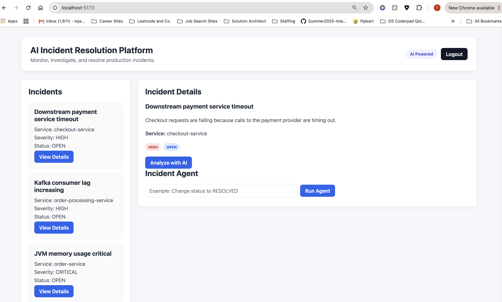
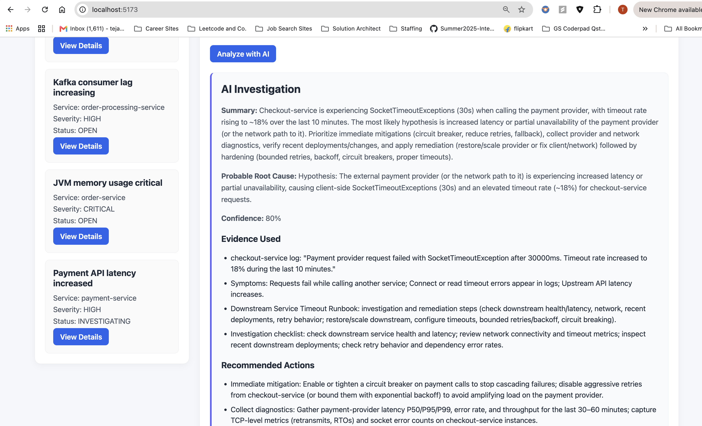
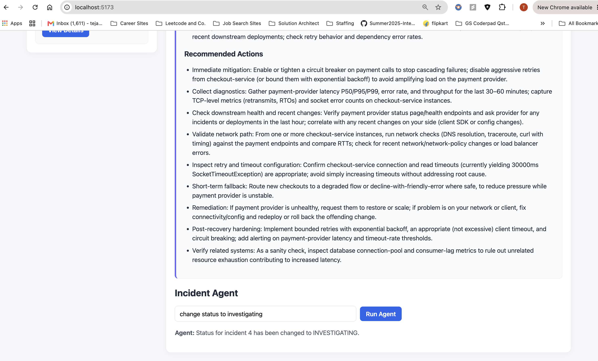

# AI-Powered Incident Resolution Platform

An AI-assisted incident response platform built with **Spring Boot, React, PostgreSQL, pgvector, Spring AI, and OpenAI**.

The platform helps engineers investigate production incidents by combining operational evidence with relevant runbooks using **Retrieval-Augmented Generation (RAG)**. It also includes a controlled AI agent that can execute approved incident-management actions through tool calling.

## Key Features

- Incident creation, tracking, severity management, and status updates
- Operational evidence ingestion for logs and metrics
- AI-generated structured incident investigations
- Retrieval-Augmented Generation (RAG) using PostgreSQL + pgvector
- Semantic retrieval of relevant operational runbooks
- AI agent with controlled tool calling for incident actions
- JWT authentication and role-based authorization
- React dashboard for incident monitoring and investigation
- Docker Compose deployment for the complete application stack

## Architecture

```mermaid
flowchart TD
    U[User] --> R[React Dashboard]
    R -->|JWT authenticated API requests| B[Spring Boot API]

    B --> A[Authentication & RBAC]
    B --> I[Incident Service]
    B --> AI[AI Investigation Service]
    B --> AG[AI Agent]

    I --> P[(PostgreSQL)]

    AI --> E[Incident Evidence]
    AI --> RS[Runbook Search Service]
    RS --> EM[OpenAI Embeddings]
    EM --> V[(pgvector)]
    V --> RS

    RS --> AI
    AI --> LLM[OpenAI LLM]
    LLM --> SR[Structured Investigation Result]

    AG --> TC[Spring AI Tool Calling]
    TC --> T[Controlled Incident Tools]
    T --> P
    
How the AI Investigation Works

When an engineer requests an investigation, the backend does not simply send the incident title to an LLM.

The application:

Loads the incident and its operational evidence.
Builds a retrieval query from the incident context.
Generates an embedding for that query.
Performs semantic similarity search against operational runbooks stored in pgvector.
Adds the most relevant runbook content to the investigation context.
Sends the grounded context to the LLM.
Returns a structured investigation containing:
Summary
Probable root cause
Confidence
Evidence used
Recommended actions

This keeps the AI investigation grounded in both real incident evidence and retrieved operational knowledge.

## Agentic AI and Tool Calling

The platform separates **AI investigation** from **AI actions**.

The investigation workflow is read-only. It analyzes incident data, evidence, and retrieved runbooks to produce a structured diagnosis.

A separate agent workflow uses Spring AI tool calling for controlled operational actions.

For example:

```text
User: "Change incident 7 status to INVESTIGATING"
                ↓
        AI Agent interprets intent
                ↓
        Spring AI requests tool call
                ↓
        Java IncidentTools validates input
                ↓
        Application updates PostgreSQL
                ↓
        Agent returns confirmation

The LLM does not receive direct database access. It can only request operations exposed through explicitly defined Java tools.

The agent is also instructed not to infer actions from ambiguous prompts. Authorization and validation remain enforced by the application rather than relying only on LLM instructions.

Security and RBAC

The application uses stateless JWT authentication with Spring Security.

Public endpoints are limited to authentication and health checks. Protected APIs require a valid JWT.

The current role model is:

Role	Capabilities
VIEWER	View incidents and request AI investigations
ENGINEER	Viewer capabilities plus evidence ingestion and controlled incident actions
ADMIN	Engineer capabilities plus administrative operations such as incident deletion

Public registration assigns the ENGINEER role server-side. Clients cannot select or elevate their own role during registration.

Sensitive operations are protected by backend authorization rules, so security does not depend on hiding controls in the React interface.


### Why the separation matters

You now have two deliberately different AI paths:

```text
/analyze
   ↓
READ-ONLY AI
RAG + diagnosis
No operational tools

/agent
   ↓
ACTION AI
Explicit tools
Can modify incident state


## Tech Stack

### Backend
- Java 17
- Spring Boot 4
- Spring Web
- Spring Data JPA / Hibernate
- Spring Security
- JWT Authentication
- Spring AI

### AI
- OpenAI chat models
- OpenAI embeddings
- Retrieval-Augmented Generation (RAG)
- Spring AI Tool Calling
- Structured LLM output

### Database
- PostgreSQL 17
- pgvector
- Flyway database migrations

### Frontend
- React
- Vite
- JavaScript
- CSS
- Nginx

### DevOps
- Docker
- Docker Compose
- Maven

## Running with Docker

### Prerequisites

Install:

- Docker Desktop
- Git

An OpenAI API key is required for embeddings and AI investigations.

### 1. Clone the repository

```bash
git clone <repository-url>
cd ai-incident-resolution-platform
```

### 2. Configure environment variables

Set the required secrets in your terminal:

```bash
export OPENAI_API_KEY='your-openai-api-key'
export JWT_SECRET='your-base64-encoded-jwt-secret'
```

Secrets are supplied through environment variables and are not stored in the repository.

### 3. Start the application

```bash
docker compose up -d --build
```

Docker Compose starts:

- React frontend with Nginx
- Spring Boot backend
- PostgreSQL 17 with pgvector

### 4. Verify the backend

```bash
curl http://localhost:8080/actuator/health
```

Expected response:

```json
{
  "status": "UP"
}
```

### 5. Open the application

Open the frontend at:

```text
http://localhost:5173
```

Create an account, sign in, and use the dashboard to view and investigate incidents.

### 6. Stop the application

```bash
docker compose down
```

To also remove the Docker database volume:

```bash
docker compose down -v
```


## API Overview

### Authentication

| Method | Endpoint | Description |
|---|---|---|
| POST | `/api/auth/register` | Register a new engineer account |
| POST | `/api/auth/login` | Authenticate and receive a JWT |

### Incidents

| Method | Endpoint | Description |
|---|---|---|
| GET | `/api/incidents` | List incidents |
| GET | `/api/incidents/{id}` | Get incident details |
| POST | `/api/incidents` | Create an incident |
| POST | `/api/incidents/{id}/evidence` | Add operational evidence |
| POST | `/api/incidents/{id}/analyze` | Run a RAG-powered AI investigation |
| POST | `/api/incidents/{id}/agent` | Execute an explicit AI-assisted incident action |
| DELETE | `/api/incidents/{id}` | Delete an incident (ADMIN only) |

Additional incident status operations are protected by role-based authorization.

## Project Structure

```text
incident-res-platform/
├── src/main/java/com/tejas/incidentplatform/
│   ├── ai/                 # AI client, RAG and agent integration
│   ├── config/             # Spring Security and application configuration
│   ├── controller/         # REST API controllers
│   ├── dto/                # API and structured AI response models
│   ├── entity/             # JPA entities
│   ├── repository/         # Database access
│   └── service/            # Application business logic
│
├── src/main/resources/
│   └── db/migration/       # Flyway migrations
│
├── frontend/               # React + Vite frontend
├── docker/postgres/        # PostgreSQL initialization
├── Dockerfile              # Spring Boot container
└── docker-compose.yml      # Full application stack
```

## Key Design Decisions

### PostgreSQL + pgvector

Incident data and vector embeddings are stored in PostgreSQL, allowing the project to use the existing relational database while adding semantic vector search through pgvector.

### Flyway Owns the Schema

Database schema changes are versioned through Flyway migrations. Hibernate validates the schema rather than generating production tables automatically.

### Application-Controlled Retrieval

The LLM does not query the database directly. The Spring Boot application decides which incident evidence and retrieved runbooks are provided to the model.

### Structured AI Responses

AI investigations are returned as a structured application model instead of unstructured text, making the output predictable and easy for the React frontend to render.

### Separate Investigation and Action Workflows

AI diagnosis and AI actions are intentionally separated. Investigation is read-only, while operational changes require the dedicated tool-enabled agent workflow.

### Backend-Enforced Authorization

Authorization is enforced with Spring Security and JWT roles at the API layer. React UI controls are not treated as a security boundary.

### Controlled Tool Calling

The AI agent can request only explicitly exposed Java tools. Database access and validation remain inside the application rather than being delegated directly to the model.

## Screenshots

### Incident Dashboard



### RAG-Powered AI Investigation



### AI Agent Tool Calling

